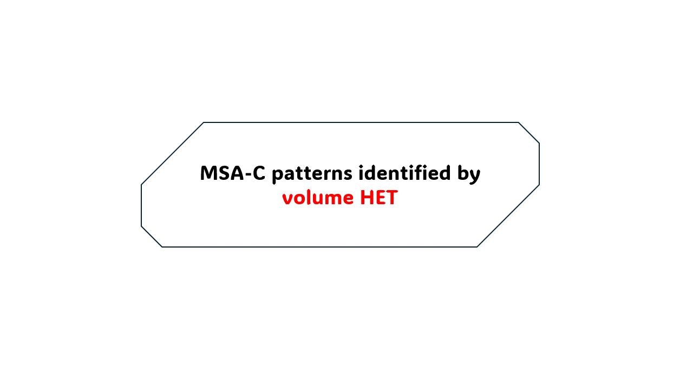
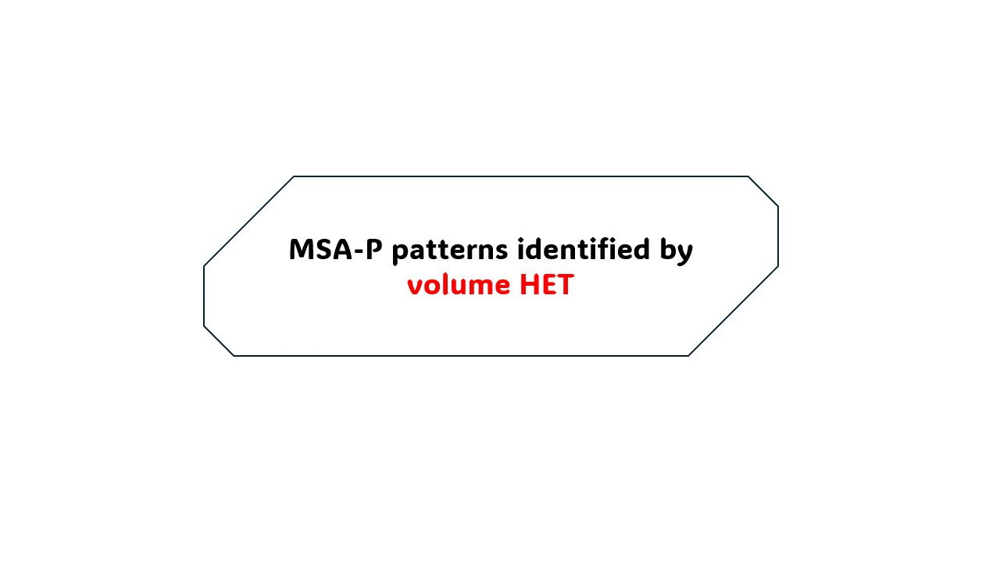
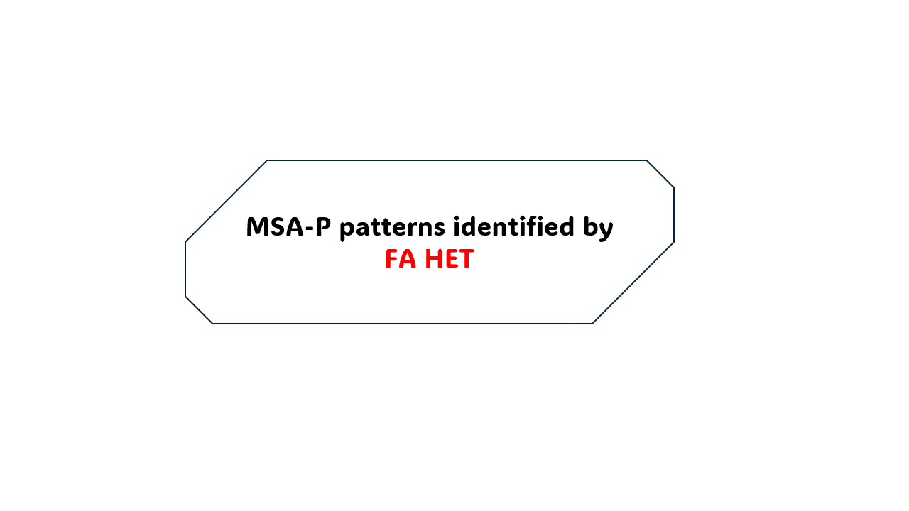
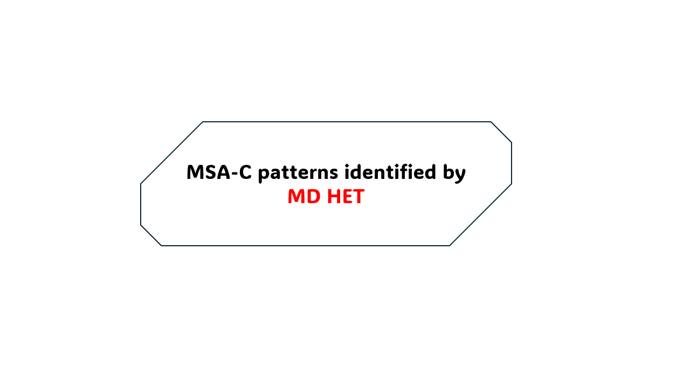

# HET: Heterogeneity of Multiple System Atrophy Using Machine Learning and MRI

This repository contains the pipeline for running several machine learning models with MRI-derived features as inputs and diagnosis as output: multiple system atrophy (0) and Parkinson's disease (PD, 1). Cross-validation using ten random seeds is used to search for the optimal model with least overfitting and best performance. The final model is used to compute **Heterogeneity (HET) scores** to account for subtype specific hetergeniety in MSA. The HET framework captures spatial heterogeneity across structural and diffusion MRI inputs and is derived directly from model-based feature importances which avoids prior assumption of histopathologic regional importance. All the patterns identified by HET match prior reporting on brain regions important for MSA-C and MSA-P. For futher details refer to the citations given at the end of this page.

The code provided in this repo performs:

1. Model training (AutoGluon and 4 tree-based classifiers)
2. SHAP feature attribution
3. Weighting of regional feature construction
4. HET score computation

---

## 1. Concept

HET captures regional hetergeniety of MSA. The following are the patterns identied by volume (top row), fractional anisotropy (FA) (middle row), and mean difusvity (MD) (bottom row) derived HET specific to MSA-C (left) and MSA-P (right)

<div align="center">
  <table>
    <tr>
      <th align="center"></th>
      <th align="center"><b>MSA-C</b></th>
      <th align="center"><b>MSA-P</b></th>
    </tr>
    <tr>
      <td align="center"><b>Volume</b></td>
      <td align="center">
        <br/>
        <sub><b>OPCA by volume HET at baseline and 1 year follow-up.</b></sub>
      </td>
      <td align="center">
        <br/>
        <sub><b>Description 2</b></sub>
      </td>
    </tr>
    <tr>
      <td align="center"><b>FA</b></td>
      <td align="center">
        <br/>
        <sub><b>Description 3</b></sub>
      </td>
      <td align="center">
        <br/>
        <sub><b>Description 4</b></sub>
      </td>
    </tr>
    <tr>
      <td align="center"><b>MD</b></td>
      <td align="center">
        <br/>
        <sub><b>Description 5</b></sub>
      </td>
      <td align="center">
        <br/>
        <sub><b>Description 6</b></sub>
      </td>
    </tr>
  </table>
</div>

---

## 2. Repo Structure

```
HET/
├── scripts/
│   ├── main.py                # Main pipeline controller
│   ├── models.py              # Model training with SGKF + AG/sklearn
│   └── feature_importance.py  # SHAP utilities and bootstrapping
├── example.csv                # Example input format
├── outputs/                   # Automatically generated results
└── README.md
```

---

## 3. Input Format

Your CSV file must contain:

- `ID` – subject identifier
- `visit` – numerical visit index
- `dx` – diagnostic label (`CON`, `MSA-C`, `MSA-P`, `PD`, etc.)
- feature columns – any numeric MRI variables

Example:
ID,visit,dx,feature_1,feature_2,...,feature_n
001,1,MSA-C,...
001,2,MSA-C,...

Feature names are automatically inferred by removing `ID`, `visit`, and `dx`.

---

## 4. Running the Pipeline

### Fresh run (train + SHAP + HET)

```
python main.py --fresh_run True --scaledata True --do_boot True
```

| Argument         | Description                            | Default  |
| ---------------- | -------------------------------------- | -------- |
| `--fresh_run`  | Train new models or load existing ones | True     |
| `--scaledata`  | Z-score features using controls        | True     |
| `--do_boot`    | Use bootstrap SHAP                     | True     |
| `--target`     | Target label column                    | dx       |
| `--model`      | Model identifier folder                | volume   |
| `--todays_run` | Custom run ID                          | YYYYMMDD |

---

## 4. Outputs

Model Outputs:

* Best classifier per seed
* Cross-validation metrics
* AutoGluon predictor folder (if used)

SHAP Outputs:

* shap_boot_mean_class_0.csv (or shap_values_class_0.csv)
* Class-specific SHAP CSVs
* SHAP summary plots per class

HET Output:

* Final data with weighted features and HET scores: training_data_het.csv

---

## Citation

If you use this code or methodology in your research, please cite:

```bibtex
@article{your_paper,
  title={MSA Heterogeneity using MRI and ML},
  author={Your Name et al.},
  journal={Journal Name},
  year={2025}
}
```

---

## License

This project is licensed under the MIT License - see below for details:

```
MIT License

Copyright (c) 2025

Permission is hereby granted, free of charge, to any person obtaining a copy
of this software and associated documentation files (the "Software"), to deal
in the Software without restriction, including without limitation the rights
to use, copy, modify, merge, publish, distribute, sublicense, and/or sell
copies of the Software, and to permit persons to whom the Software is
furnished to do so, subject to the following conditions:

The above copyright notice and this permission notice shall be included in all
copies or substantial portions of the Software.

THE SOFTWARE IS PROVIDED "AS IS", WITHOUT WARRANTY OF ANY KIND, EXPRESS OR
IMPLIED, INCLUDING BUT NOT LIMITED TO THE WARRANTIES OF MERCHANTABILITY,
FITNESS FOR A PARTICULAR PURPOSE AND NONINFRINGEMENT. IN NO EVENT SHALL THE
AUTHORS OR COPYRIGHT HOLDERS BE LIABLE FOR ANY CLAIM, DAMAGES OR OTHER
LIABILITY, WHETHER IN AN ACTION OF CONTRACT, TORT OR OTHERWISE, ARISING FROM,
OUT OF OR IN CONNECTION WITH THE SOFTWARE OR THE USE OR OTHER DEALINGS IN THE
SOFTWARE.
```
